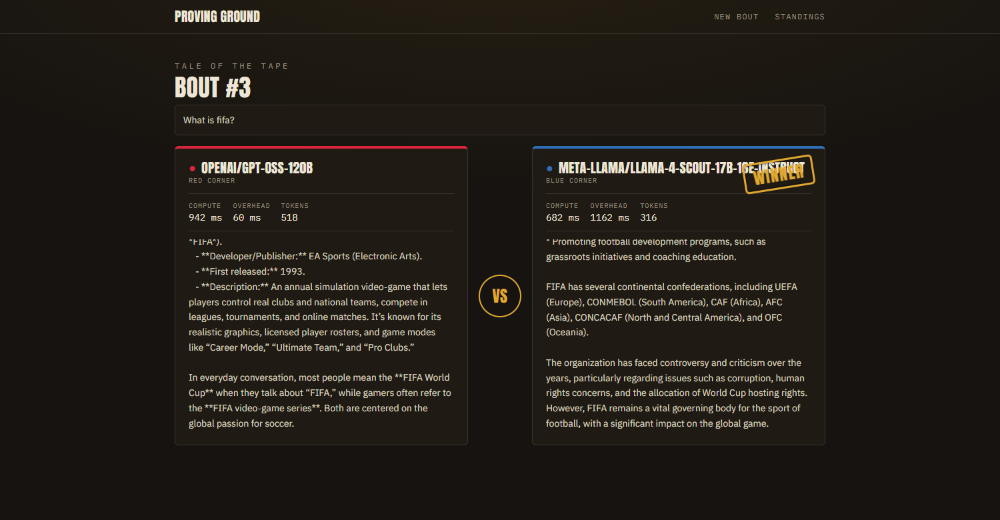
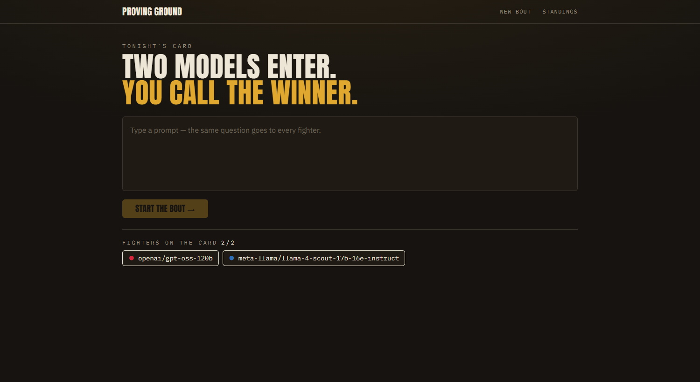
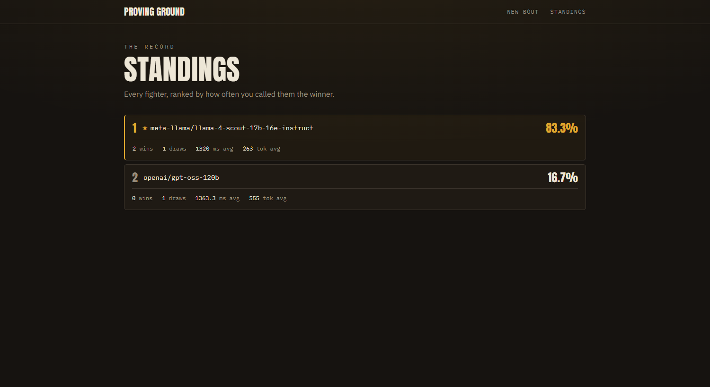
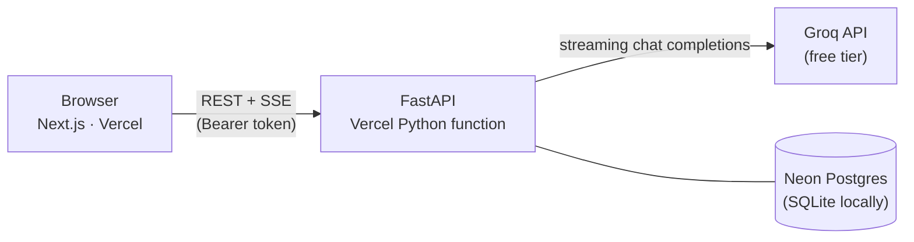

# 🥊 Proving Ground

**Two models enter. You call the winner.**

Send one prompt to multiple LLMs, watch their answers stream in side by side, judge the bout, and track a running leaderboard of wins, draws, latency, and token usage — all for **$0** using free-tier models.

<p align="center">
  <a href="https://proving-ground-fc.vercel.app"></a>
  
  
  
  
  
</p>



> **[Try it live →](https://proving-ground-fc.vercel.app)** The app is gated by an access token — the lock screen gives you the hint. 🎬

---

## How it works

1. **Write one prompt.** It goes to every fighter on the card simultaneously.
2. **Watch the answers stream live** — token by token over SSE, with per-model compute time (Groq's own figure), network overhead, and token counts.
3. **Judge the bout.** Pick a winner (the other model is automatically marked the loser) or call a draw. Verdicts are write-once — no re-voting.
4. **Check the standings.** The leaderboard ranks every model by win rate, with wins, draws, average latency, and average tokens.

| Build the bout | The standings |
| :---: | :---: |
|  |  |

A model that fails (rate limit, network) shows up as an error card — it never sinks the rest of the bout.

## Architecture



- **Frontend** — Next.js (App Router), TypeScript strict, Tailwind CSS v4. Hand-written UI, no component library.
- **Backend** — FastAPI + SQLAlchemy + Pydantic, deployed as a Vercel Python serverless function. Talks to Groq's OpenAI-compatible endpoint directly with `httpx` — no SDK.
- **Streaming** — `POST /runs` creates pending rows and returns instantly; the client opens one `EventSource` per model and the backend relays Groq's token deltas as they arrive, persisting the final output and usage when done.
- **Auth** — a single shared token gates every route except `/health`. Fail-closed: if the token isn't configured, the API locks itself rather than opening up.
- **Scoring** — each response gets a float rating (`1` win, `0.5` draw, `0` loss); win % is just the average × 100. The leaderboard is computed on the fly with a `GROUP BY` — nothing to keep in sync.

### API

| Method | Route | Description |
| --- | --- | --- |
| `GET` | `/health` | Liveness check (the only open route) |
| `GET` | `/models` | Current model lineup |
| `POST` | `/runs` | Create a bout — returns immediately with pending responses |
| `GET` | `/responses/{id}/stream` | SSE stream of one model's answer |
| `GET` | `/runs` · `/runs/{id}` | Bout history / single bout |
| `PUT` | `/responses/{id}/rating` | Record a verdict (write-once, `409` on re-vote) |
| `GET` | `/leaderboard` | Per-model standings, computed live |

## Running locally

**Prerequisites:** Python 3.11+, Node 18+, and a free [Groq API key](https://console.groq.com/keys).

**Backend** (SQLite, no database setup needed):

```bash
cd backend
python -m venv .venv && .venv/Scripts/activate   # Windows; use source .venv/bin/activate on macOS/Linux
pip install -r requirements.txt
cp ../.env.example .env                          # set GROQ_API_KEY and APP_TOKEN
uvicorn app.main:app --reload --port 8002
```

**Frontend:**

```bash
cd frontend
npm install
echo "NEXT_PUBLIC_API_URL=http://localhost:8002" > .env.local
npm run dev
```

Open http://localhost:3000 and enter your `APP_TOKEN` at the lock screen.

**Tests:**

```bash
cd backend && python -m pytest    # runs on SQLite, no network or API key needed
```

## Deployment ($0)

The stack runs entirely on free tiers — no credit card anywhere: two Vercel projects from this one repo (root directories `frontend/` and `backend/`) plus a [Neon](https://neon.tech) Postgres database.

1. **Database** — create a Neon project and copy the connection string, rewriting the prefix to `postgresql+psycopg2://…`. Tables auto-create on first boot.
2. **Backend** — Vercel project with root directory `backend/` (runs as a Python function via `backend/api/index.py`). Env vars: `GROQ_API_KEY`, `DATABASE_URL`, `APP_TOKEN`, `FRONTEND_ORIGIN`.
3. **Frontend** — Vercel project with root directory `frontend/`. Env var: `NEXT_PUBLIC_API_URL` = the backend's URL.
4. The two URLs reference each other: deploy the backend first, point the frontend at it, then set the backend's `FRONTEND_ORIGIN` to the frontend's URL and redeploy.

## Notes & limitations

- **Free model IDs churn.** Groq rotates its free lineup; refresh from `/openai/v1/models` before changing the pair in `backend/app/config.py`. Current card: `openai/gpt-oss-120b` vs `meta-llama/llama-4-scout-17b-16e-instruct`.
- **Rate limits are part of the show.** Free tiers 429 sometimes; the UI surfaces it as a per-model error card and the bout carries on.
- **Single user by design.** One shared token, no accounts — it's a personal eval bench, not a SaaS.
